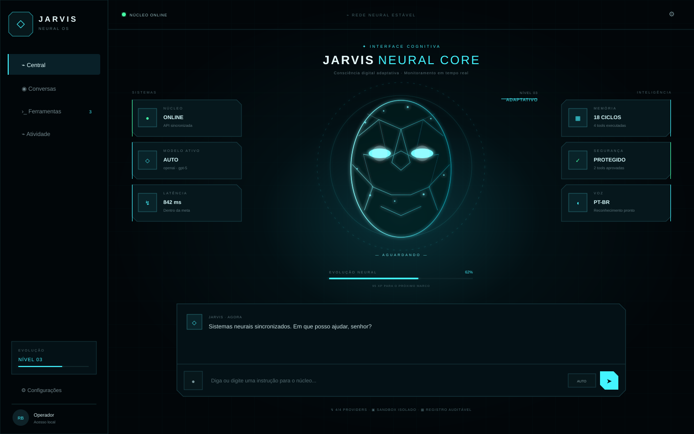
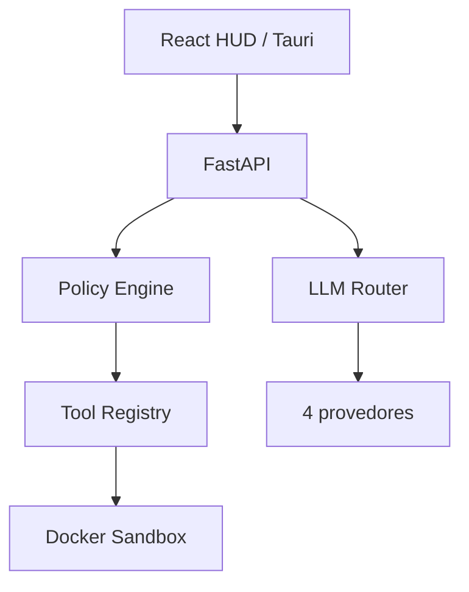
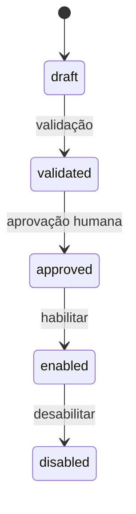

# Jarvis

Assistente pessoal **voice-first**, multi-LLM e extensível, projetado para transformar linguagem natural em respostas e ações auditáveis. A fundação combina uma interface HUD em React, API FastAPI, shell desktop Tauri e execução permissionada de ferramentas em Docker.

> **Estado atual:** versão `v0.2.0`. O dashboard neural, a evolução auditável, o chat, o roteador multi-LLM e o ciclo seguro de tools estão implementados; wake word nativa, memória vetorial e autonomia multi-etapas permanecem no roadmap.



## O que já funciona

| Recurso | Estado | Observação |
|---|---:|---|
| Chat por texto | ✅ | Usa API real ou modo demonstração sem credenciais |
| Rosto neural evolutivo | ✅ | Cinco estágios visuais alimentados por métricas auditáveis do backend |
| Telemetria lateral | ✅ | Núcleo, modelo, latência, memória, segurança e voz |
| OpenAI, Anthropic, Gemini e xAI | ✅ | Contratos HTTP e seleção manual |
| Roteamento automático | ✅ | Classifica tarefas de código, raciocínio, criatividade e uso geral |
| Voz no navegador | 🧪 | Web Speech API, conforme suporte do navegador |
| Personalidade | ✅ | Prompt seguro com estilo elegante e sarcasmo sutil |
| Registro e auditoria de tools | ✅ | SQLite local e estados explícitos |
| Aprovação humana | ✅ | Validação obrigatória e confirmação adicional para alto risco |
| Sandbox Docker | ✅ | Sem rede, somente leitura e com limites de CPU, memória e processos |
| Desktop | 🧪 | Shell Tauri inicial |
| Wake word nativa e barge-in | 🗓️ | Planejado |
| Memória de longo prazo | 🗓️ | Planejado |

## Arquitetura



Detalhes e fronteiras de confiança estão em [docs/architecture.md](docs/architecture.md). O PRD normalizado está em [docs/PRD.md](docs/PRD.md).

## Início rápido

### Requisitos

- Python 3.12+
- Node.js 22+
- Docker (necessário apenas para executar tools)

### 1. Configure o backend

```bash
git clone https://github.com/Ronickbr/jarvis.git
cd jarvis
python -m venv .venv
source .venv/bin/activate              # Windows: .venv\Scripts\activate
pip install -e ".[dev]"
cp .env.example .env
uvicorn jarvis_api.main:app --app-dir services/api --reload --port 8000
```

Sem chaves, o sistema inicia em modo demonstração. Para respostas reais, preencha uma ou mais variáveis em `.env`:

```dotenv
OPENAI_API_KEY=
ANTHROPIC_API_KEY=
GEMINI_API_KEY=
XAI_API_KEY=
```

Nunca envie o arquivo `.env` ao Git. A documentação interativa da API fica em `http://localhost:8000/docs`.

### 2. Inicie a interface

Em outro terminal:

```bash
npm install --prefix apps/web
npm --prefix apps/web run dev
```

Acesse `http://localhost:5173`.

### Docker Compose

```bash
cp .env.example .env
docker compose up --build
```

Interface: `http://localhost:4173` · API: `http://localhost:8000/docs`

## Evolução neural

O nível do rosto não é escolhido aleatoriamente. O backend calcula XP usando somente marcos positivos registrados no log de auditoria: conversas concluídas, providers configurados e tools criadas, validadas, aprovadas ou executadas com sucesso. Falhas, bloqueios e execuções negadas não geram progresso.

| Nível | Estágio | XP mínimo |
|---:|---|---:|
| 1 | Núcleo | 0 |
| 2 | Senciente | 100 |
| 3 | Adaptativo | 250 |
| 4 | Cognitivo | 500 |
| 5 | Ômega | 900 |

## Ciclo de uma tool



Uma tool em `draft` nunca é executada. Tools de alto risco exigem confirmação imediatamente antes da chamada. Se Docker estiver indisponível, o backend recusa execução — não existe fallback local inseguro.

Endpoints principais:

| Método | Endpoint | Finalidade |
|---|---|---|
| `GET` | `/api/v1/health` | Saúde e versão |
| `GET` | `/api/v1/providers` | Provedores configurados |
| `GET` | `/api/v1/evolution` | Nível, XP, progresso, marcos e métricas auditáveis |
| `POST` | `/api/v1/chat` | Conversa e roteamento |
| `POST` | `/api/v1/tools` | Cria tool como rascunho |
| `POST` | `/api/v1/tools/{id}/validate` | Valida o código |
| `POST` | `/api/v1/tools/{id}/approve` | Registra decisão humana |
| `POST` | `/api/v1/tools/{id}/execute` | Executa no sandbox |

## Segurança

Esta versão é destinada a desenvolvimento local e **ainda não possui autenticação multiusuário**. Não exponha a API diretamente à internet. Saídas de LLM são tratadas como conteúdo não confiável; segredos não são enviados ao frontend; CORS aceita somente origens locais conhecidas.

O sandbox reduz risco, mas não substitui revisão humana nem uma infraestrutura de isolamento dedicada. Consulte [SECURITY.md](SECURITY.md) antes de habilitar ferramentas próprias.

## Testes

```bash
pytest
ruff check services/api
npm --prefix apps/web run build
```

## Roadmap

- STT/TTS locais com Whisper e Piper, wake word e interrupção de fala.
- Memória de longo prazo com consentimento, expiração e busca semântica.
- Métricas de custo, latência, fallback e saúde dos provedores.
- Editor visual de tools, testes gerados e permissões por capacidade.
- Autenticação local forte, cofre de segredos e pacotes desktop assinados.

## Contribuição e licença

Leia [CONTRIBUTING.md](CONTRIBUTING.md) antes de abrir um pull request. O projeto é distribuído sob a [Apache License 2.0](LICENSE).
