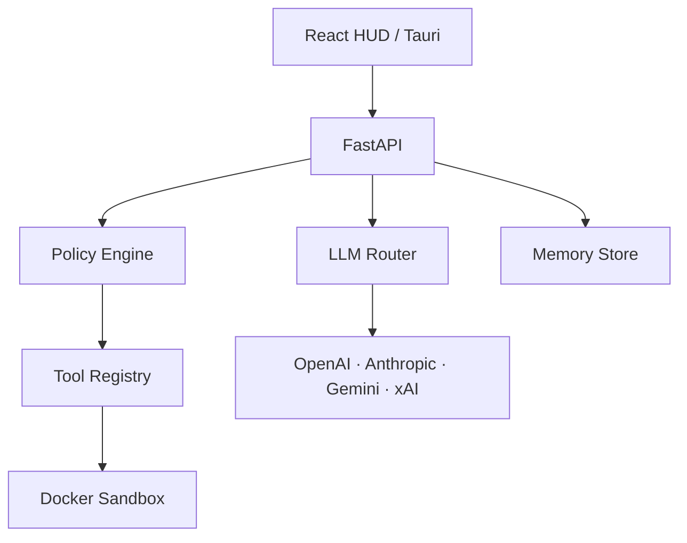

# Arquitetura

## Visão

## Fronteiras de confiança

1. O frontend nunca recebe chaves armazenadas no servidor.
2. O orquestrador trata toda saída de LLM como dado não confiável.
3. Chamadas de tools passam pelo Policy Engine antes da execução.
4. Código gerado é armazenado como rascunho e exige aprovação.
5. O executor Docker inicia sem rede, com filesystem somente leitura, limites de CPU/memória e capabilities removidas.

## Estados de uma tool dinâmica

`draft → validated → approved → enabled → disabled`

Uma tool só pode ser invocada nos estados `approved` ou `enabled`. Alterações no código retornam a tool para `draft`.

## Roteamento

O roteador pontua provedores por capacidade, preferência, saúde, custo e latência. O MVP implementa o contrato e o modo automático; telemetria histórica e comparação paralela entram em fases posteriores.
